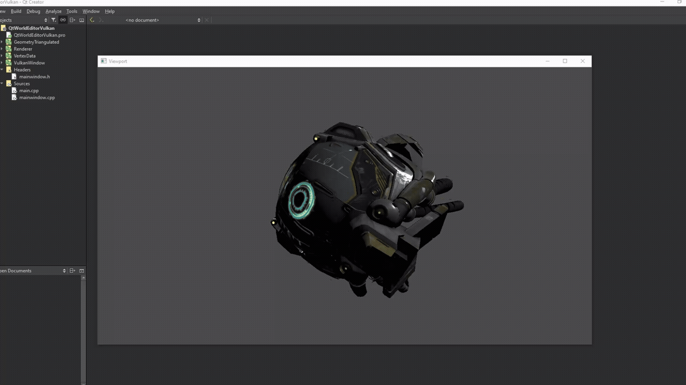

# QtWorldEditorVulkan

**Работа велась в 2021.**

`WorldEditorVulkan` — попытка интеграции Vulkan рендера в QtWorldEditor.
Проект построен вокруг разделения CPU-данных, GPU-ресурсов и систем, управляющих их жизненным циклом.
Рендерер не владеет ресурсами напрямую, а лишь координирует их использование.

## Цели проекта

- Построние архитектуры рендера с поддержкой Vulkan.
- Разделение CPU/GPU ресурсов.
- Асинхронная загрузка ресурсов

## Vulkan Test #1

## Основные системы

### ModelLoader (CPU уровень)

Цель:

- Загрузка моделей с диска и формирование CPU-представления геометрии.
- Формирование CpuMesh

### CpuMesh (CPU представление геометрии)

Цель:

- Чистое описание меша на CPU.

### UploadContext (GPU upload / staging)

Цель:

- Асинхронная загрузка данных на GPU.
- Решает проблемы:
  - staging buffers
  - layout transitions
  - fences
  - lifetime staging ресурсов

### MaterialSystem

Цель:

- Управление материалами и descriptor set’ами lit моделей

### VkRenderItem

Цель:

- Связать GPU-ресурсы + материал + transform в то, что можно нарисовать.

### Renderer

Цель:

- Подготовка Pipelines.
- Контроль ресурсов Vulkan (инициализация и удаление).
- Выполнение draw-команд.

## Используемые технологии

- C++20
- Vulkan
- tinyobjloader
- Qt Creator 15.0.0 Based on Qt 6.8.1 (GCC 14.2.0, x86_64)

## Как собрать

Открыть QtWorldEditorVulkan.pro в Qt.

## TODO

- Продумать размер DescriptorPool
- Добавить Unlit PipelineLayout
- Переписать UploadContext на TransferQueue (в Qt тяжело "чисто" получить transfer queue)
- Поправить TODO в коде
- Интеграция в QtWorldEditor
